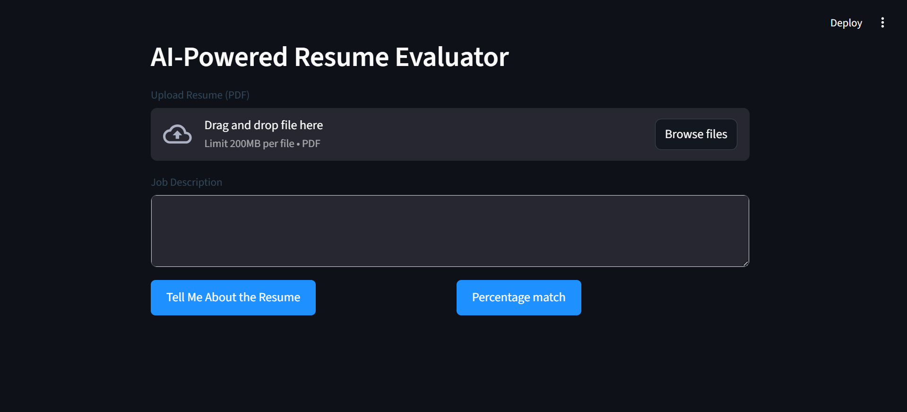

# AI-Powered Resume Evaluator

The AI-Powered Resume Evaluator automatically reviews a candidate’s resume (PDF) against a given job description using OpenAI `GPT-4o-mini` via the OpenAI Responses API.
It simulates both a human recruiter and an Applicant Tracking System (ATS) to evaluate how well a resume matches the job role.
The app provides a detailed report including job expectations, resume alignment, match percentage, and professional feedback — all in real time through a clean Streamlit web interface.

---

## 🚀 Features

- 📄 Upload PDF resume and paste job description
- 🧠 Uses OpenAI  `GPT-4o-mini` with native PDF input (no manual text extraction)
- 🧾 Returns 4-section detailed report
    - About the Job
    - Your Resume
    - Match Percentage
    - Summary & Feedback

---

## 📦 Tech Stack

| Layer                | Technology              | Purpose                             |
| -------------------- | ----------------------- | ----------------------------------- |
| **UI**               | Streamlit               | Interactive web interface           |
| **LLM Engine**       | GPT-4o-mini             | Core multimodal model (text + PDF)  |
| **Styling**          | Custom CSS              | UI consistency and branding         |

---

## 📁 Project Structure

```
User
 ├── Upload Resume (PDF)
 ├── Paste Job Description
 ▼
[ Streamlit UI ]
 ├── Build Prompt + PDF Handle
 ▼
[ Openai Flash Model ]
 ├── Compare Resume ↔ JD
 ├── Generate JSON Output
 ▼
[ Streamlit Renderer ]
 ├── Parse JSON → Show 4 Sections
 ├── Delete Uploaded File
 ▼
Result: ATS-style evaluation

```

---

## 📸 Preview



---

## ⚙️ Environment Setup

### Create Virtual Environment
```
python -m venv venv
source venv\Scripts\activate
```

### Install Dependencies
```
pip install -r requirements.txt
```

### Run the App
```
streamlit run app.py
```

---

## Author

👤 **[Vetrivel Maheswaran](https://github.com/Vetrivel07)**

## Connect With Me 🌐

**[](https://www.linkedin.com/in/vetrivel-maheswaran/)**

**[](https://vetrivel07.github.io/vetrivel-maheswaran)**

<p align="center"><b>© Created by Vetrivel Maheswaran</b></p>
